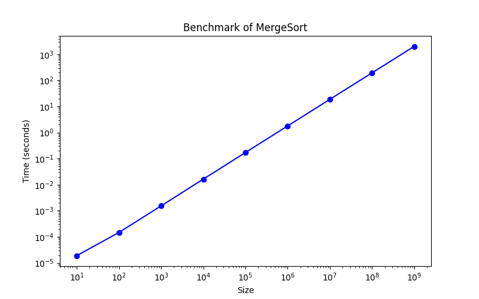

## how to run it 

make

./program size

## how to clean 

make clean

## how to benchmark

cd ITCS4145mergeSort

make

sbatch script.sh

## how to run python graphing 

cd ITCS4145mergeSort

python3 plot.py

